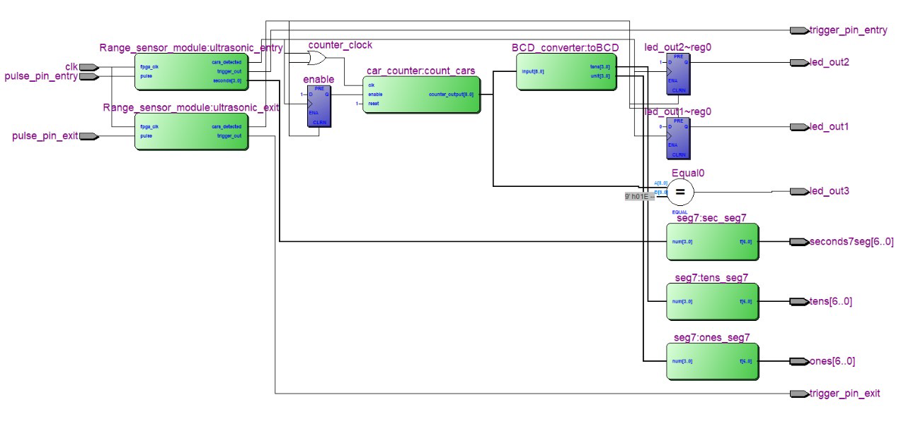

# 🚗 FPGA-Based Parking Garage Control System

This project implements a **smart parking management system** using **VHDL on an FPGA (Cyclone V)**. It integrates **ultrasonic sensors**, **digital counters**, **7-segment displays**, and **state-driven control logic** to monitor and display the number of vehicles inside a parking garage. 

The design is modular and testable, showcasing embedded design practices including **modular hardware description**, **signal synchronization**, **digital counting**, and **real-time display output**. All components are written in **VHDL**, synthesized and tested using **Intel Quartus II** and **ModelSim**.

---

## 🧠 Project Highlights

| Feature                        | Description |
|-------------------------------|-------------|
| 💡 Main Objective             | Design and implement a real-time parking garage controller using VHDL |
| 🧮 Core Logic                 | Finite State Machine (FSM) with real-time pulse detection and car counting |
| 📊 Outputs                    | Two 7-segment displays, LED status indicators (Entry, Exit, Full) |
| 📏 Sensor Interface           | Ultrasonic pulse-based range sensing |
| 🔄 Reset and Timing           | Asynchronous reset, clock-based timing control |
| 🔬 Development Tools          | Quartus II, ModelSim |
| 🧩 FPGA Target Board          | Cyclone V DE1-SoC |

---

## 📁 File Structure

### ✅ `ParkingSystem.vhd` *(Main Top-Level Design)*
This is the **main architectural file** of the system. It instantiates all subcomponents, including:
- **Ultrasonic sensor modules**
- **Vehicle counter**
- **BCD converter**
- **7-segment display drivers**

Key functionalities:
- Controls LED indicators for entry, exit, and full state.
- Aggregates pulse signals from sensors.
- Manages FSM logic for car detection and count control.
- Displays the vehicle count in real-time.

---
## 🔍 RTL Schematic View

Below is the Register Transfer Level (RTL) schematic of the complete parking garage system as synthesized in Quartus:

---

## 🔧 Component Modules

### 🔄 `TriggerGenerator.vhd`
Generates **periodic ultrasonic trigger signals** using a generic counter.
- Converts clock cycles into microsecond precision delays (250 ms & 100 µs).
- Activates the ultrasonic sensor pulse for accurate measurement.

**Skills Highlighted**: Clock division, timing control, parameterized counter usage.

---

### 📏 `DistanceCalculation.vhd`
Handles the **pulse-width measurement** to calculate vehicle distance.
- Multiplies pulse width to approximate distance.
- Uses threshold logic to detect car presence.
- Triggers LEDs and enables vehicle counting logic.

**Skills Highlighted**: Signal processing, conditional latching, pulse-width to distance conversion.

---

### 🧮 `VehicleCounter.vhd`
Implements a **car counter** using rising clock edges:
- Increments count when a vehicle enters.
- Decrements count on exit.
- Restricts count to a defined capacity (up to 30 vehicles).

**Skills Highlighted**: Synchronous design, edge detection, FSM-based counting logic.

---

### 🔢 `BCDConverter.vhd`
Converts a 9-bit binary number into **BCD format** for display purposes.
- Uses the **double-dabble algorithm** for efficient conversion.
- Outputs 3 BCD digits: Hundreds, Tens, and Units.

**Skills Highlighted**: Binary-BCD conversion, algorithmic logic in VHDL.

---

### 🖥️ `display7.vhd`
Drives **7-segment displays** for numerical output.
- Maps 4-bit binary values to 7-bit display segments using `WITH...SELECT`.
- Displays values 0–9 with a fallback for invalid inputs.

**Skills Highlighted**: Decoder logic, display interfacing, conditional hardware mapping.

---

## ✅ System Features

- Real-time entry/exit detection using ultrasonic sensing.
- Visual feedback through LEDs:
  - Green LED: Entry event
  - Yellow LED: Exit event
  - Red LED: Garage full (30 cars)
- 2-digit 7-segment display to show current vehicle count.
- Robust handling of signal glitches using edge detection and FSM.

---

## 📌 Skills Demonstrated

✅ Digital Design Principles  
✅ FSM Design & Control Logic  
✅ Modular VHDL Development  
✅ Real-time Signal Processing  
✅ Sensor Integration (Ultrasonic)  
✅ Display Interfacing (7-Segment)  
✅ Simulation & Debugging in ModelSim  
✅ Synthesis & Timing Constraints in Quartus II  

---

## 🧪 Testing & Simulation

All modules are designed to be **testbench-compatible** for simulation in ModelSim. The top-level module can be synthesized for deployment on the DE1-SoC FPGA.

---

## 📷 Future Improvements

- Integrate UART interface to send real-time data to PC.
- Add LCD interface for detailed status display.
- Upgrade sensor logic to support multiple garage lanes.

